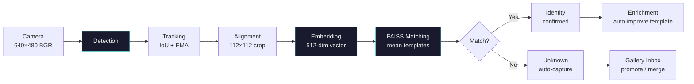
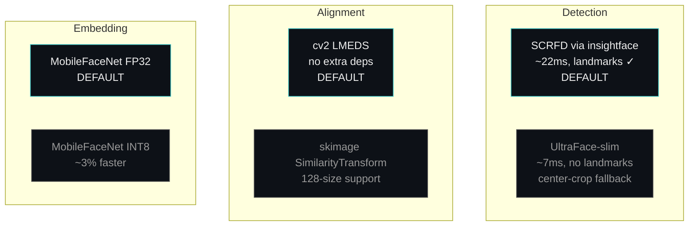

# rpi-face-recognition

Modular face recognition pipeline for Raspberry Pi 5. Swappable backends, live MJPEG dashboard with guided enrollment wizard, FAISS matching, gallery with unknown-capture workflow.

## Pipeline



### Swappable Backends



All backends are swappable at runtime via the **Settings page** (`/settings`) — no restart needed.

## Quick Start (Raspberry Pi) — One Command

```bash
git clone https://github.com/dl4cv-ai-pinnacle/rpi-face-recognition.git
cd rpi-face-recognition
bash scripts/service.sh setup
```

This handles everything from zero: installs system packages, uv, Python deps, insightface, downloads models, creates a systemd service, and starts it. Dashboard will be at `http://<pi-ip>:8080/`.

### Service Management

```bash
bash scripts/service.sh up       # Start (creates systemd unit if needed)
bash scripts/service.sh down     # Stop
bash scripts/service.sh restart  # Restart
bash scripts/service.sh status   # Show status
bash scripts/service.sh logs     # Follow logs (Ctrl+C to stop)
```

### Manual Setup (step by step)

If you prefer manual control:

```bash
# 1. Clone and enter
git clone https://github.com/dl4cv-ai-pinnacle/rpi-face-recognition.git
cd rpi-face-recognition

# 2. Install system deps
sudo apt install -y python3-picamera2 python3-opencv python3-libcamera

# 3. Create venv with system-site-packages (needed for Pi camera bindings)
uv venv --python 3.13 --system-site-packages

# 4. Install Python deps
uv sync --python 3.13

# 5. Download models
bash scripts/download_models.sh

# 6. Install insightface (default detector)
uv pip install insightface

# 7. Start the live server
uv run --python 3.13 python -m server.app
```

Open `http://<pi-ip>:8080/` in a browser.

## Dashboard

The live dashboard at `/` shows a cinema-mode layout:
- **Center:** MJPEG live stream with face detection overlay
- **Left panel:** real-time FPS, face count, gallery size, and an enrollment call-to-action that pulses when unknown faces appear
- **Right panel:** system metrics (CPU, temp, memory) and pipeline performance

### Enrollment Wizard

Navigate to `/enroll-wizard` for guided multi-pose enrollment:


- **Auto-capture:** Pose is estimated from SCRFD landmarks (nose-to-eye distance ratio). When the correct pose is held for ~1 second, the frame auto-captures. Green overlay confirms detection.
- **Manual fallback:** A Capture button is always available (required for UltraFace which has no landmarks).
- **Multi-pose rationale:** ArcFace embeddings degrade at 15-30° yaw. Three poses (frontal, left, right) produce a mean template that matches reliably across angles.
- **Add samples:** The wizard also works for existing identities — add camera samples from the identity detail page.

### Identity Persistence

Once a face is identified (e.g., "Andrii"), the identity is **held for the entire track** even if individual re-embeddings dip below threshold when the person turns their head. Only after 5 consecutive misses does the identity downgrade. Tracks that were ever identified never create unknown fragments.

## Configuration

All settings in `config.yaml`. Key options:

```yaml
detection:
  backend: "insightface"    # or "ultraface" for 3x faster (recognition via center-crop)

alignment:
  method: "cv2"             # or "skimage" for research flexibility

embedding:
  quantize_int8: false      # set true for ~3% faster inference
```

Settings are also changeable at runtime via `/settings` or `POST /api/config`.

## API

| Endpoint | Method | Description |
|---|---|---|
| `/` | GET | Live dashboard (cinema mode) |
| `/gallery` | GET | Gallery management — enroll, promote, merge, delete |
| `/gallery/identity?slug=...` | GET | Identity detail with sample grid |
| `/enroll-wizard` | GET | Guided multi-pose enrollment from camera |
| `/settings` | GET | Pipeline settings panel |
| `/stream.mjpg` | GET | Raw MJPEG stream |
| `/metrics.json` | GET | Live metrics JSON |
| `/style.css` | GET | Shared stylesheet |
| `/api/config` | GET | Current active config as JSON |
| `/api/config` | POST | Update config, hot-swap pipeline components |
| `/api/config/backends` | GET | Available backends per stage |
| `/api/capture-frame` | POST | Capture frame, detect face, estimate pose |
| `/api/enroll-captures` | POST | Enroll from captured frames (wizard) |
| `/enroll` | POST | Enroll from file upload (gallery form) |
| `/gallery/promote` | POST | Promote unknown to named identity |
| `/gallery/rename` | POST | Rename identity |
| `/gallery/merge-unknowns` | POST | Merge two unknowns |
| `/gallery/delete-unknown` | POST | Delete unknown |
| `/gallery/delete-identity` | POST | Delete identity |
| `/gallery/delete-sample` | POST | Delete single sample |
| `/gallery/upload-samples` | POST | Upload photos to existing identity |

## Development (macOS/Linux)

```bash
# Install deps (no camera — Pi only)
uv sync --python 3.13

# Run tests
uv run --python 3.13 pytest

# Type check
uv run --python 3.13 pyright src/ server/

# Lint
uv run --python 3.13 ruff check src/ server/ tests/
```

## Project Structure

```
src/                    Pipeline modules (Protocols, config, detection, embedding, etc.)
server/                 Live HTTP dashboard (MJPEG stream, gallery UI, settings, wizard)
scripts/                Model download, service management
tests/                  Behavioral tests with DI stubs
docs/                   Architecture, attributions, benchmark findings
config.yaml             Default configuration
slop/                   Archived individual prototypes (read-only)
```

See `docs/ARCHITECTURE.md` for full details. See `docs/ATTRIBUTIONS.md` for component origins.

## References

Video benchmarks use the [ChokePoint](http://arma.sourceforge.net/chokepoint/) dataset:

> Y. Wong, S. Chen, S. Mau, C. Sanderson, B.C. Lovell.
> *Patch-based Probabilistic Image Quality Assessment for Face Selection and Improved Video-based Face Recognition.*
> IEEE Biometrics Workshop, Computer Vision and Pattern Recognition (CVPR) Workshops, pages 81-88. IEEE, June 2011.

## Team

- **Valenia** — gallery, live runtime, tracking, quality, metrics, benchmarks, tests, enrollment wizard
- **Shalaiev** — insightface SCRFD, UltraFace, cv2 alignment, display, FAISS+SQLite, graceful degradation
- **Avdieienko** — YAML config, clean architecture, DI wiring, model download, documentation
